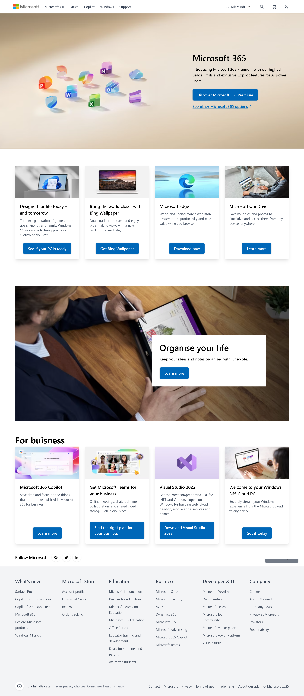

# 💻 Microsoft Clone Website (React + Vite + Tailwind CSS)

A fully responsive **Microsoft Homepage Clone** built using **React.js**, **Vite**, and **Tailwind CSS**.  
This project replicates the design and functionality of Microsoft’s official homepage — with modern frontend techniques, reusable components, and responsive layouts for all devices.

---

## 🌟 Features

✅ **Fully Responsive Design** — Works seamlessly across desktop, tablet, and mobile.  
✅ **Interactive Header** — Hamburger menu, search, cart, and sign-in icons.  
✅ **Dynamic Hero Sections** — Background images, headings, paragraphs, buttons, and links.  
✅ **Cards Section** — Grid-based layout for showcasing products and features.  
✅ **Follow Microsoft Section** — Social media icons with a functional “Back to Top” button.  
✅ **Professional Footer** — Multiple columns, dynamic links, and responsive structure.  
✅ **Smooth User Experience** — Built with reusable components and Tailwind CSS utility classes.

---

## 🧩 Tech Stack

- ⚛️ **React.js** – Component-based UI
- ⚡ **Vite** – Fast bundler and development server
- 🎨 **Tailwind CSS** – Modern utility-first CSS framework
- 🧠 **JavaScript (ES6+)** – Core logic and interactivity

---

## 📸 Project Screenshots

### 🏠 Homepage

---

## 🏗️ Folder Structure

microsoft-clone/
├── public/
├── src/
│ ├── assets/ # Images and static assets
│ ├── components/
│ │ ├── Header.jsx
│ │ ├── AllTooltip.jsx
│ │ ├── Footer.jsx
│ │ ├── BodyContent/
│ │ │ ├── HeroSection.jsx
│ │ │ ├── SectionOne.jsx
│ │ │ ├── SectionTwo.jsx
│ │ │ ├── SectionThree.jsx
│ │ │ ├── FollowSection.jsx
│ ├── App.jsx
│ ├── main.jsx
│ └── index.css
└── package.json

---

# 👨‍💻 Author

- Engr. Hammad Ashraf
- 📍 Future Full Stack MERN Developer
